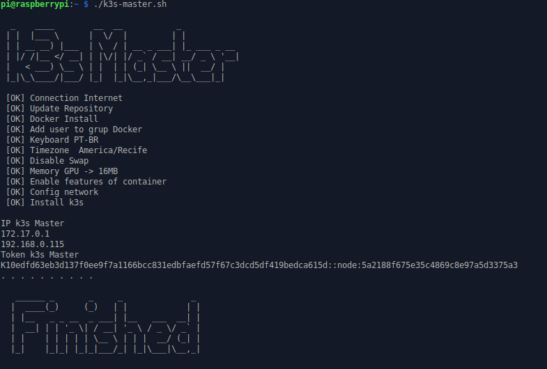
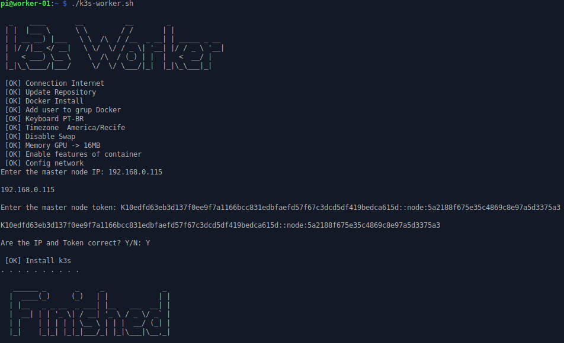

# :tada: Kubernetes (K3S) cluster configuration script in Raspbian :tada:

This repository is intended to provide initial Kubernetes cluster configurations for use on the Raspbian with K3S operating system on Raspberry PI 3. The K3S tool enables simplified startup and maintenance of a Kubernentes cluster and is optimized for ARM platform (K3S, 2019).

## Screenshot :camera:

  



## Getting Started :rocket: :running: :walking:

The following steps provide instructions for installing the cluster on the master node and the worker node.

### Installing :wrench:

1. **Master Node** :computer:

Download or clone this project:
```bash
git clone https://github.com/franciscojsc/scripts-install-k3s.git 
```

Enter the folder:
```bash
cd  scripts-install-k3s/
```

Assign Execute Permission to Scripts:
```bash
sudo chmod +x *.sh 
```

Run the install script:
```bash
./k3s-master.sh
```

2. **Worker Node** :computer:

Download or clone this project:
```bash
git clone https://github.com/franciscojsc/scripts-install-k3s.git 
```

Enter the folder:
```bash
cd  scripts-install-k3s/
```

Assign Execute Permission to Scripts:
```bash
sudo chmod +x *.sh 
```

Run the install script:
```bash
./k3s-worker.sh
```

## Authors

 :man: **Francisco Chaves** - *Initial work* 
 * :octocat: Github: [@franciscojsc](https://github.com/franciscojsc)
 * :link: Website: [https://franciscochaves.com.br](https://franciscochaves.com.br)
 * :email: Email: contato@franciscochaves.com.br
 
## License 

This project is licensed under the MIT License - see the [LICENSE](LICENSE) file for details

## Acknowledgments :balloon: :balloon: :balloon:

* [Projeto Kube](https://projetokube.github.io)
* [K3S](https://k3s.io/)
* [Will it cluster? k3s on your Raspberry Pi](https://blog.alexellis.io/test-drive-k3s-on-raspberry-pi)
* [How to conditionally do something if a command succeeded or failed](https://unix.stackexchange.com/questions/22726/how-to-conditionally-do-something-if-a-command-succeeded-or-failed)
* [Ascii art generetor](http://patorjk.com/software/taag/)
